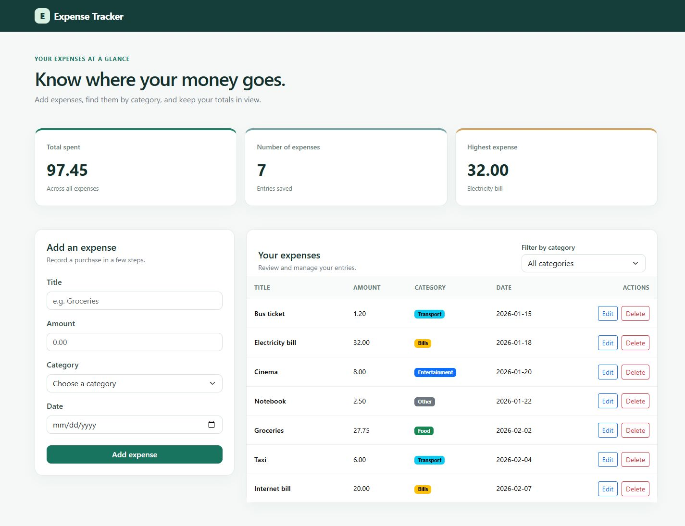
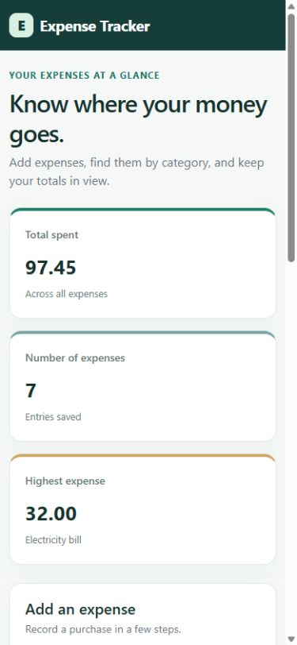
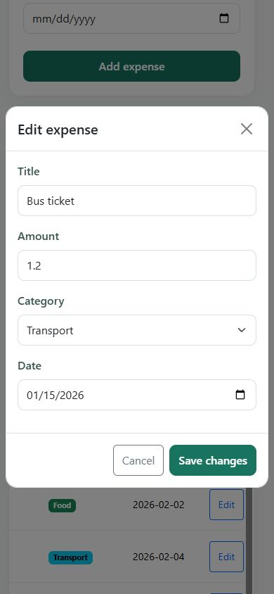

> **Note:** In VS Code, press `Ctrl + Shift + V` to view this README with clear formatting and images.

# Expense Tracker

A web app for keeping track of personal expenses. You can add, edit, delete, and filter expenses. The app saves your data in a PostgreSQL database.

GitHub repository: [First Project](https://github.com/AbdallahAlshiekhAbdallah/First-Project-.git).

## Features

- Add an expense with a title, amount, category, and date.
- Edit or delete saved expenses.
- Filter expenses by category.
- Search expenses by title while typing, together with the category filter.
- See the total amount, number of expenses, and highest expense.
- Keep saved expenses after refreshing the page or restarting the server.
- Show messages when an entry is wrong or data cannot load.
- Use the app on desktop and phone screens.

## Tools used

- **Frontend:** HTML, CSS, JavaScript, and Bootstrap.
- **Backend:** Node.js and Express.
- **Database:** PostgreSQL.

## Project structure

```text
expense-tracker-starter/
├── frontend/
│   ├── index.html
│   ├── Images/
│   │   └── favicon.png
│   ├── css/style.css
│   └── js/app.js
├── backend/
│   ├── server.js
│   ├── schema.sql
│   ├── .env.example
│   ├── package.json
│   └── package-lock.json
├── Images/
├── .gitignore
└── README.md
```

## How to run the project

### 1. Get the tools ready

Install Node.js with npm, PostgreSQL with pgAdmin, and the Live Server extension in VS Code. Open the `expense-tracker-starter` folder in VS Code.

### 2. Set up the database

1. Open pgAdmin and connect to your PostgreSQL server.
2. Create a database named `expense_tracker`.
3. Open the Query Tool for this database.
4. Open [backend/schema.sql](backend/schema.sql) and run the full script.

The script creates the expenses table and adds eight sample expenses. Running it again deletes the current expenses and adds the sample data again.

### 3. Set up the server

Open a terminal in the project folder and run:

```powershell
cd backend
Copy-Item .env.example .env
```

Open `.env` and enter your PostgreSQL connection details:

```dotenv
DB_HOST=localhost
DB_PORT=5432
DB_USER=postgres
DB_PASSWORD=replace_with_your_password
DB_NAME=expense_tracker
PORT=3000
```

Use your own database username, password, and database port. Keep the app server on port `3000`, because the frontend uses it. Do not share your `.env` file.

Then run:

```powershell
npm install
npm start
```

Keep this terminal open while using the app. You can check the server and database by opening `http://localhost:3000/api/expenses` in your browser. It should show the saved expenses.

### 4. Open the app

Right-click [frontend/index.html](frontend/index.html) in VS Code and choose **Open with Live Server**.

Keep the app server running.

To stop the server, press `Ctrl+C` in the terminal. To start it again, run `npm start` from the `backend` folder.

## How to use the app

- **Add:** fill in the four fields and click **Add expense**.
- **Edit:** click **Edit**, change the details, and click **Save changes**.
- **Delete:** click **Delete** and confirm.
- **Filter:** choose a category, or choose **All categories** to see every expense.
- **Search:** type part of a title in **Search by title**. Matching ignores uppercase and lowercase; clear the search to show all titles in the selected category. The summary always includes all expenses.

## Input rules

| Field | Rule |
| --- | --- |
| Title | Required, with no more than 100 characters. |
| Amount | Greater than zero, with up to two decimal places. |
| Category | Food, Transport, Bills, Entertainment, or Other. |
| Date | A valid date in `YYYY-MM-DD` format. |

## API

The API lets the frontend read and change saved expenses.

| Request | What it does |
| --- | --- |
| `GET /api/expenses` | Get all expenses. |
| `GET /api/expenses/:id` | Get one expense by its ID. |
| `POST /api/expenses` | Add an expense. |
| `PUT /api/expenses/:id` | Edit (Update) an expense. |
| `DELETE /api/expenses/:id` | Delete an expense. |

To test adding or editing an expense in Thunder Client, choose **Body → JSON** and use:

```json
{
  "title": "Coffee",
  "amount": 2.5,
  "category": "Food",
  "date": "2026-10-01"
}
```

API test screenshots are in the [Images folder](Images/).

## Screenshots

### Desktop

The page shows the summary, add form, category filter, and expense table.



### Phone

The summary cards appear in one column.



### Editing on a phone

The edit window lets you change an expense and save it.



## Main challenges

Connecting the page to the server and database takes several steps. The page uses `fetch` to send requests, and the server reads or changes data in PostgreSQL. After adding, editing, or deleting an expense, the page loads the updated list and summary.

CSS Grid arranges the summary cards in one, two, or three columns to fit the screen size.

## Common problems

- **Database error:** check that PostgreSQL is running, the `.env` details are correct, and the database table was created.
